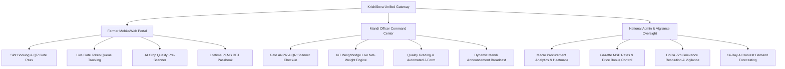

# <p align="center">🌾 KrishiSeva (कृषि सेवा)</p>

<p align="center">
  <strong>National Smart Farmer Procurement, Zero-Queue Mandi Logistics & AI Agri-OS Platform</strong>
</p>

<p align="center">
  <em>Department of Consumer Affairs · Ministry of Consumer Affairs, Food & Public Distribution · Government of India</em>
</p>

<p align="center">
  
  
  
  
  
  
  
</p>

---

## 🌟 Vision & Executive Summary

**KrishiSeva** is an enterprise-grade agricultural operating system engineered to transform how Bharat's farmers interact with APMC mandis. Historically, farmers endure **12 to 36 hours** stranded in tractor queues under extreme weather, suffer **8–15% unauthorized weight deductions (katoti)** from middlemen, and wait up to **90 days** for procurement checks to clear.

**KrishiSeva eliminates these systemic bottlenecks:**
- ⏱️ **Zero-Queue Arrival Guarantee**: 1-hour digital time-slot quotas slash mandi wait times from 18 hours to **under 25 minutes**.
- ⚖️ **Certified IoT Weighbridge Telemetry**: Zero-trust gross/tare weight capture with digital calibration seals.
- 💳 **72-Hour Direct Benefit Transfer (DBT)**: Instant PFMS batch payment triggers directly into farmer Aadhaar-seeded accounts.
- 🔬 **AI Pre-Assessment Crop Lab**: On-device computer vision & moisture analyzers to diagnose grain grade and avoid gate rejection.
- 🛰️ **Space-Agri Infrastructure**: Sentinel-2 & SAR satellite vegetative biomass cross-referenced with state Khasra cadastral records to prevent ghost-billing and trader dumping.

---

## 🛠️ Technology Stack & Architectures

<p align="center">
  
</p>

### Frontend Architecture
| Layer | Technologies & Libraries | Purpose |
|---|---|---|
| **Framework** | `React 19` + `TypeScript` + `Vite 6` | High-speed, responsive SPA with atomic UI components |
| **Styling & Aesthetics** | `TailwindCSS` + Glassmorphism + `Lucide Icons` | Agrarian design system, Dark Mode, organic textures |
| **State Management** | `Zustand` | Lightweight reactive stores for Auth, Language & Theme |
| **Offline & PWA** | `Vite PWA` + `Workbox` | Local service worker caching for low-connectivity rural zones |
| **Visualizations** | `Leaflet` + `Recharts` | Real-time GIS mandi load heatmaps & harvest arrival graphs |

### Backend & API Architecture
| Layer | Technologies & Libraries | Purpose |
|---|---|---|
| **Runtime & Server** | `Node.js 22` + `Express.js` + `TypeScript` | Enterprise RESTful API with route clustering |
| **Database** | `PostgreSQL` + Resilient In-Memory Fallback Engine | Relational schemas with zero-downtime offline simulator |
| **Security & RBAC** | `JWT` + `Bcrypt` + `Helmet` + `Express-Validator` | Role-Based Access Control (`farmer`, `officer`, `admin`) |
| **Document Generation** | `PDFKit` + `QRCode` | Automated government Form J sale slips & digital gate passes |
| **Edge & Serverless** | `@vercel/node` Serverless Functions | Instant global scale with automated cold-start mitigation |

---

## 🏛️ Tri-Portal System Breakdown



---

## 🚀 20 Breakthrough Agricultural Innovations

KrishiSeva embeds a comprehensive suite of **20 deep-tech tools** accessible directly within the platform:

1. 🛰️ **Sentinel-2 & SAR Satellite Cap**: Cadastral GIS biomass analysis preventing unauthorized trader grain dumping.
2. ⚖️ **Zero-Trust Weighbridge IoT**: Direct load-cell telemetry streaming with anti-tamper calibration hashes.
3. 🎙️ **Multilingual Dialect Voice IVR**: Voice AI supporting rural dialects (*Malwai Punjabi, Haryanvi, Bhojpuri, Magahi, Bundelkhandi*).
4. 🏦 **e-NWR Spot Micro-Loans**: Instant warehouse collateral loan disbursal preventing distress selling.
5. 🚜 **Tractor-Uber Freight Pooling**: Shared logistics matching nearby farmers to slash transport costs by 35%.
6. 🌿 **Stubble Carbon Coins**: Satellite-verified bio-decomposition rewarding farmers ₹1,500/ton for zero-burning.
7. ⛈️ **Doppler Storm Shield**: 3-hour radar alerts with automated motorized mandi shed canopies.
8. 🕵️ **Jan-Samvaad Whistleblower**: Encrypted audio/photo whistleblower channel with direct CVO escalation.
9. 📡 **Micro-Silo Spoilage IoT**: LoRaWAN temperature & moisture sensors predicting grain mold 72h in advance.
10. 🛸 **Drone-as-a-Service (DaaS)**: Certified drone pilot dispatch for precision fertilizer and pesticide spraying.
11. 🔬 **Spectrophotometer Fertilizer Lab**: Optical wavelength spectrometer detecting adulterated urea and fake DAP.
12. 🐛 **Acoustic Stem-Borer Scanner**: Audio resonance frequency probe detecting hidden sub-surface grain larvae.
13. 🔒 **Tamper-Evident Blockchain Ledger**: Merkle-tree verified procurement receipts immune to administrative backdating.
14. 🌧️ **Parametric Rain Index Insurance**: Hyper-local weather telemetry triggering automatic payouts without adjuster delays.
15. 📈 **Mandi Arbitrage Engine**: Inter-mandi net profit calculator factoring in diesel costs and live market premiums.
16. 📷 **ANPR Fast-Track Gate Camera**: 15-second gate entry matching tractor registration numbers with slot QR passes.
17. 🔥 **Parali Biomass Circular Marketplace**: Connecting rice straw producers directly to 2G ethanol bio-refineries.
18. ❄️ **Solar Micro-Cold Storage**: 100% solar micro-cold rooms with flexible crate rental for perishables.
19. ⚖️ **AI Lokpal Legal Ombudsman**: Instant arbitration hearings resolving mandi grade disputes within 15 minutes.
20. 🎖️ **Green Credit Kisan Passport**: Comprehensive environmental compliance score unlocking lower KCC loan interest rates.

---

## 🌐 Supported Regional Languages

KrishiSeva is localized with seamless in-app switching across **6 major regional languages**:

| Code | Language | Native Script | Primary Regional Focus |
|---|---|---|---|
| `en` | English | English | Pan-India / Administrative |
| `hi` | Hindi | हिन्दी | North & Central India |
| `pa` | Punjabi | ਪੰਜਾਬੀ | Punjab (Wheat & Paddy Bowl) |
| `hr` | Haryanvi | हरियाणवी | Haryana (Mustard & Grain Belts) |
| `bn` | Bengali | বাংলা | West Bengal (Paddy & Jute) |
| `mr` | Marathi | मराठी | Maharashtra (Cotton, Soybean & Pulses) |

---

## 💻 Local Development Setup

### Prerequisites
- **Node.js** >= 18.x
- **npm** >= 9.x
- **Git**

### Installation

```bash
# 1. Clone the repository
git clone https://github.com/Rakshit0229/KrishiSeva_a_platform_for_farmers.git
cd KrishiSeva_a_platform_for_farmers

# 2. Install dependencies across the monorepo
npm install

# 3. Start both backend and frontend concurrently
npm run dev
```

- **Frontend App**: `http://localhost:5173`
- **Backend API**: `http://localhost:4000`
- **Mandi TV Display Board**: `http://localhost:5173/display/10000000-0000-0000-0000-000000000001`

---

## 📦 Deployment on Vercel

KrishiSeva is pre-configured for 1-click deployment via GitHub:

1. Import the repository into [Vercel](https://vercel.com/new).
2. Ensure the **Root Directory** is set to `./` (default).
3. The root `vercel.json` automatically routes frontend builds to `apps/frontend/dist` and serverless API requests to `api/index.ts`.
4. Click **Deploy**.

---

## 📜 Official Ministry Compliance
Designed under the technical guidelines of the **Department of Consumer Affairs (DoCA)** and the **Price Support Scheme (PSS)**, Ministry of Consumer Affairs, Food and Public Distribution, Government of India.

<p align="center">
  <strong>Empowering Bharat's Annadata With Technology, Dignity & Transparency 🌾🇮🇳</strong>
</p>
